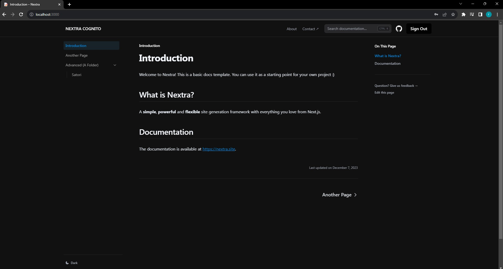
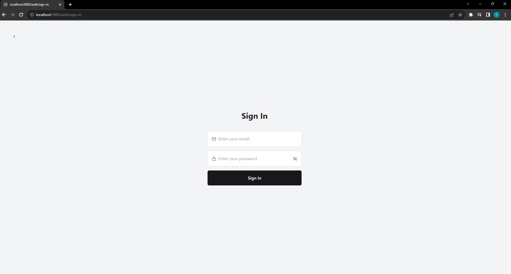
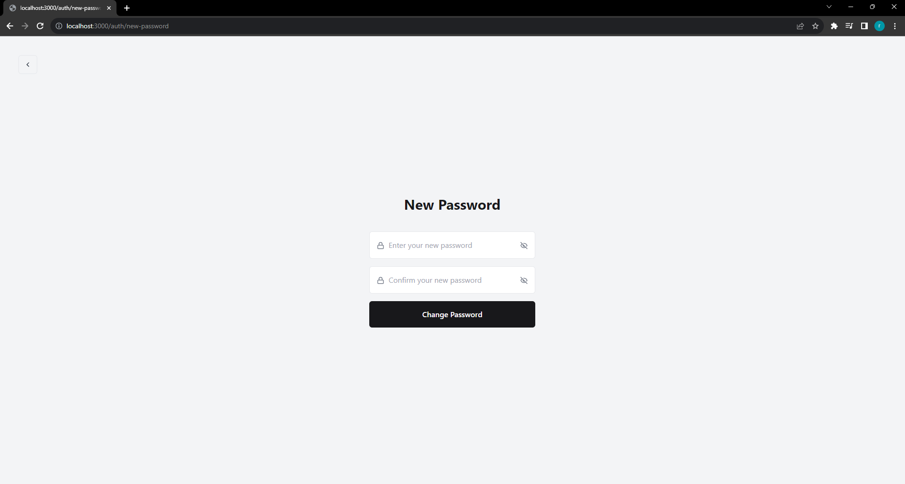
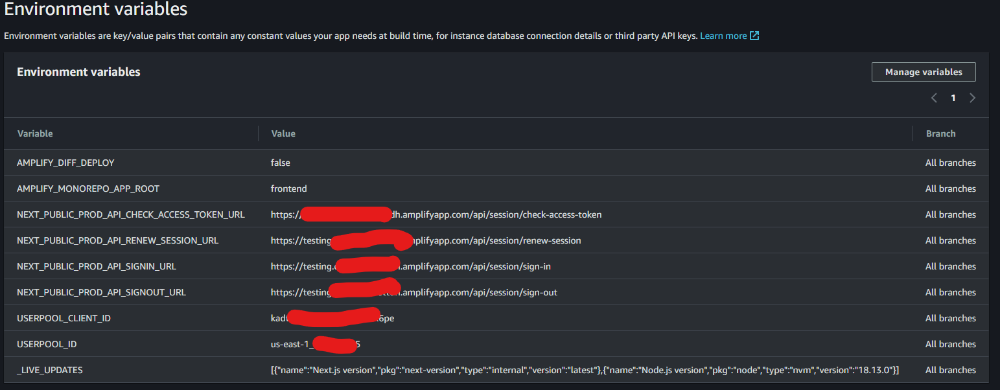
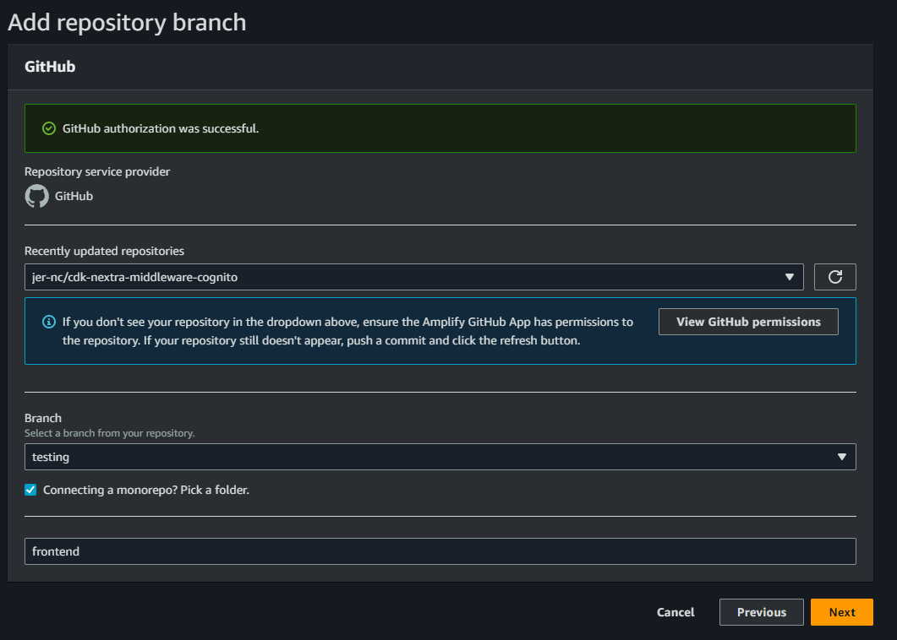

# NEXTRA DOCS COGNITO MIDDLEWARE

## Description

This project is an experiment where we encapsulate a Nextra application with authentication using Next.js middleware with AWS Cognito.

We've utilized AWS Cognito for authentication and validated the Access Token JWT's validity within the middleware. It's hosted on AWS Amplify.

| /                        | /auth/sign-in               | /auth/new-password               |
| ------------------------ | --------------------------- | -------------------------------- |
|  |  |  |            


> Note: This repository is experimental, we are not experts in Next.js. We've noticed that the middleware behaves differently in production, as requests are cached. However, for our purposes, we haven't delved deeper into this behavior.

## Motivation

In collaboration with a colleague, we needed to create documentation for our side projects. We didn't find a comprehensive, well-formatted solution based on Markdown. While Nextra is a good option, it's primarily designed for public documentation. We were exploring Next.js middleware and thought about encapsulating Nextra to create private documentation.

We acknowledge that this isn't a perfect solution, and our code has room for improvement. Nevertheless, it could serve as a starting point for other developers.

## How it Works

Administrators can create users in the Cognito pool by generating new users with an email and temporary password. In the Nextra app, users will enter these temporary credentials. If they haven't yet changed their temporary password, they'll be redirected to the `auth/new-password` page to create a new password. Afterward, they can log in normally in subsequent sessions.

## Pages

Nextra uses the pages router. The app contains two custom pages:

- `auth/sign-in`: Login form.
- `auth/new-password`: Form to set a new password.

## CDK

The CDK contains the creation of an AWS Cognito Pool. You can modify it to suit your preferences. If you're unfamiliar with CDK, you can create the Pool from the AWS console.

## .env

You should create an `.env` file and replace the values according to the information from a Cognito Pool and your production environment URLs once it's hosted.

```env
USERPOOL_ID=us-east-1_XXXXXXX 
USERPOOL_CLIENT_ID=XXXXXXXXXXXXXXXXXXXX
NEXT_PUBLIC_DEV_BASE_URL=http://localhost:3000/api/session/
NEXT_PUBLIC_PROD_API_SIGNIN_URL=https://XXX.amplifyapp.com/api/session/sign-in
NEXT_PUBLIC_PROD_API_SIGNOUT_URL=https://XXX.amplifyapp.com/api/session/sign-out
NEXT_PUBLIC_PROD_API_RENEW_SESSION_URL=https://XXX.amplifyapp.com/api/session/renew-session
NEXT_PUBLIC_PROD_API_CHECK_ACCESS_TOKEN_URL=https://XXX.amplifyapp.com/api/session/check-access-token
```

## Amplify Hosting:

### Build Image Settings:

- Node.js `18.13.0`
- Next.js `14/latest`



### File: amplify.yml

We've added the environment variables to the build phase. This configuration is necessary to build the app with the environment variables. We don't know if there's a better way to do this.

```yml
version: 1
applications:
  - frontend:
      phases:
        preBuild:
          commands:
            - npm ci
        build:
          commands:
            - env | grep -e USERPOOL_ID >> .env.production
            - env | grep -e USERPOOL_CLIENT_ID >> .env.production
            - env | grep -e NEXT_PUBLIC_PROD_API_SIGNIN_URL >> .env.production
            - env | grep -e NEXT_PUBLIC_PROD_API_SIGNOUT_URL >> .env.production
            - env | grep -e NEXT_PUBLIC_PROD_API_RENEW_SESSION_URL >> .env.production
            - env | grep -e NEXT_PUBLIC_PROD_API_CHECK_ACCESS_TOKEN_URL >> .env.production
            - npm run build
      artifacts:
        baseDirectory: .next
        files:
          - '**/*'
      cache:
        paths:
          - node_modules/**/*
    appRoot: frontend
```

### Amplify Monorepo

Connect AWS Amplify with GITHUB. Choose the repository and branch. Write frontend as entry directory.



Configure monorepo Amplify hosting: https://docs.aws.amazon.com/amplify/latest/userguide/build-settings.html#build-settings-monorepo